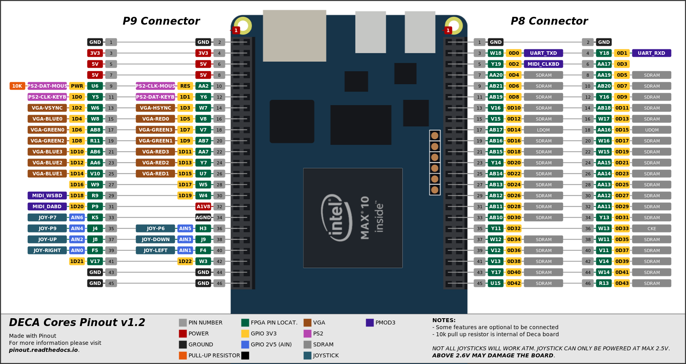

# xxxxxxxxxxx DeMiSTified - Deca port

22/09/21 DECA port DeMiSTified by Somhic from original MiST xxxxx core https://github.com/mist-devel/xxxxxxx.   

27/11/21 DECA port by Somhic from original Demistified MiST core https://github.com/robinsonb5/xxxxx by Alastair M. Robinson.

[Read this guide if you want to know how I DeMiSTified this core](https://github.com/DECAfpga/DECA_board/tree/main/Tutorials/DeMiSTify).

**THIS PORT REQUIRES A SDRAM MODULE WITH SEPARATED DQMH/L SIGNALS** (3 pins old MiSTer memory modules should work)

**Now compatible with [Deca Retro Cape 2](https://github.com/somhi/DECA_retro_cape_2)** (new location for 3 pins of old SDRAM modules). Otherwise see pinout below to connect everything through GPIOs.

**Features for Deca board**

* ~~HDMI video output (special resolution will not work on all LCD monitors)~~
* VGA 444 video output is available through GPIO. 
* Audio I2S Line out (3.5 jack green connector) and HDMI audio output
* MIDI output and MIDI I2S mixing available though an external mt32-pi synthesizer ([MIDI2SBC](https://github.com/somhi/MIDI_I2S_SBC_Pmod_Edge_Interface))
* ~~Sigma-Delta audio available through GPIO~~
* Joystick available through GPIO. 
  * **Joystick power pin must be 2.5 V. DANGER: Connecting power pin above 2.6 V may damage the FPGA**
  * This core was tested with a Megadrive 6 button gamepad. A permanent high level is applied on pin 7 of DB9, so only works buttons B and C.

**Additional hardware required**

- SDRAM module
  - Tested with 32 MB SDRAM board for MiSTer (extra slim) XS_2.2 ([see connections](https://github.com/SoCFPGA-learning/DECA/tree/main/Projects/sdram_mister_deca))
  - Tested with a dual memory module v1.3 with 3 pins ([see connections](https://github.com/SoCFPGA-learning/DECA/tree/main/Projects/sdram_mister_deca) + [3pins](https://github.com/DECAfpga/DECA_board/blob/main/Sdram_mister_deca/README_3pins.md))
- PS/2 Keyboard connected to GPIO

**Optional USB keyboard input**

Experimental support for USB low speed keyboards  (old & cheap). A mini USB to USB A female adaptor is needed  to be connected into the USB connector next to HDMI. <u>If not working try disconnecting power and/or program again the board.</u> 

To generate bitstream with USB support edit the  /deca/deca_top.vhd and change the defined variable DECA_KEYB to 2 at the top of the file.

##### Versions

* 22xxxx VGA version only

### STATUS

* Working fine

* ~~HDMI video outputs special resolution so will not work on all monitors.~~ 

### Binaries

Fins .sof and .svf binary bitstreams for this core at the corresponding category at https://github.com/DECAfpga/DECA_binaries

### Instructions to compile the project for a specific board:

```sh
git clone https://github.com/DECAfpga/[core_name]
cd [core_name]
#Do a first make (will finish in error) but it will download missing submodules 
make
cd DeMiSTify
#Create file site.mk in DeMiSTify folder 
cp site.template site.mk
#Edit site.mk and add your own PATHs to Quartus (Q18)
gedit site.mk
#Go back to root folder and do a make with board target (deca, neptuno, uareloaded, atlas_cyc). If not specified it will compile for all targets.
cd ..
make BOARD=deca
#when asked just accept default settings with Enter key
```

After that you can:

* Flash bitstream directly from [command line](https://github.com/DECAfpga/DECA_binaries#flash-bitstream-to-fgpa-with-quartus)
* Load project in Quartus from /deca/[core_name]_deca.qpf

### Pinout connections:



Mouse is not required to use this core

For 444 video DAC use all VGA pins. For 333 video DAC connect MSB from addon to MSB of location assignment (e.g. connect pin VGAR2 from Waveshare addon to VGA_R[3] Deca pin).

**Others:**

* Button KEY0 is a reset button

### OSD Controls

* F12 show/hide OSD 
* Long F12 toggles VGA/RGB mode
* The reset button KEY0 resets the controller (so re-initialises the SD card if it's been changed, reloads any autoboot ROM.) The OSD Reset menu item resets the core itself.

